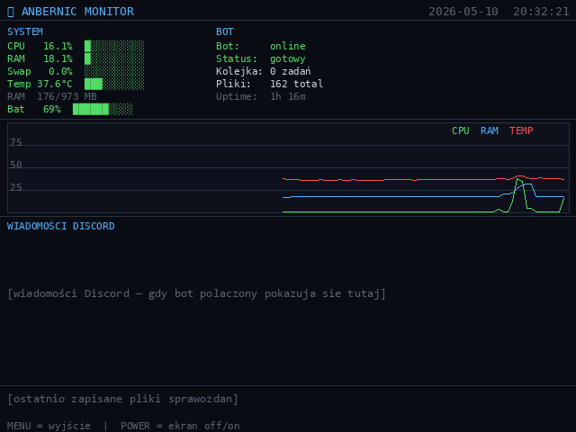

# AnberMon


Lekki **monitor systemu** dla **Anbernic RG40XX V** — pokazuje na żywo CPU, RAM, swap, temperaturę CPU, baterię, uptime + **wykres czasowy** (CPU/RAM/Temp z 4-minutowej historii). Sterowany D-padem, z możliwością wygaszenia ekranu przyciskiem POWER bez wyłączenia aplikacji.



Opcjonalnie integruje się z [AnbernBot](https://github.com/karolfurtak/AnbernBot) — wyświetla stan bota Discord (online/offline, kolejka, aktywne zadania, ostatnie wiadomości i pliki).

## Features

- **Sekcja SYSTEM:** CPU%, RAM% (+ MB used/total), Swap%, Temp °C, bateria (% + status ładowania) — wszystko z paskami progresu i kodowaniem kolorystycznym (zielony/żółty/czerwony wg progów)
- **Sekcja BOT** *(opcjonalna):* status online/offline (psutil scan procesu `anberbot.py`), kolejka zadań, liczba plików w `/mnt/data/sprawozdania/`, uptime
- **Wykres czasowy** 640×100px: 3 linie (CPU zielona, RAM niebieska, Temp °C czerwona) na wspólnym układzie współrzędnych 0-100, siatka co 25%, 4 minuty historii (120 próbek × 2s)
- **Wiadomości Discord** *(z integracją AnbernBot):* ostatnie 12 wiadomości z kanałów / wątków
- **Ostatnie pliki** *(z integracją AnbernBot):* 3 ostatnio zapisane pliki sprawozdań
- **POWER button toggle ekranu** — naciśnij POWER raz: wygaszenie LCD przez `/sys/class/graphics/fb0/blank=4`, AnberMon dalej działa. Naciśnij ponownie: ekran wraca. Aplikacja co 200ms ponawia write — kernel nie zdąży przywrócić podświetlenia.
- **Atomic activity file** — bezpieczny odczyt JSON z bota, brak race condition
- Auto-restore ekranu na wyjściu

## Sterowanie

| Przycisk | Akcja |
|---|---|
| **MENU** (lub BTN_MODE) | Wyjście |
| **POWER** | Toggle ekran on/off (po 5s guard od startu) |
| **ESC** (BT klawiatura) | Wyjście |

Po starcie 5-sekundowy *guard period* — pierwsze klawisze ignorowane (zapobiega przypadkowemu wyjściu z dmenu).

## Wymagania

### Hardware

- **Anbernic RG40XX V** (Allwinner H700, axp2202 PMIC, 640×480 LCD landscape)
- inne RG40-serii **mogą działać** (kody przycisków evdev są zgodne z większością RG40xxx) — niesprawdzone

### Firmware

Tworzone i testowane na **stock Anbernic firmware build `20251225`**:
- Ubuntu 22.04.x LTS (Jammy)
- Kernel `4.9.170` (Allwinner H700 BSP)
- App Center: `dmenu.bin` (vendor)
- File: `/mnt/vendor/oem/version.ini` → `20251225`
- File: `/mnt/vendor/oem/board.ini` → `RG40xxV`

Inne firmware (muOS, Knulli, garlicOS) — niesprawdzone, mogą wymagać:
- innych kodów przycisków evdev (MENU może być inne niż 354)
- innej ścieżki do baterii (zamiast `axp2202-battery`)
- innej obsługi `fb0/blank` (POWER toggle może nie działać)

### System packages

Stock firmware już zawiera. Jeśli czegoś brakuje:
```bash
apt update
apt install python3 python3-pip libsdl2-2.0-0 fonts-dejavu
```

| Pakiet | Wersja stock | Rola |
|---|---|---|
| `libsdl2-2.0-0` | 2.0.20 | renderer SDL2 |
| `python3` | 3.10.x | runtime |
| `fonts-dejavu` (DejaVuSansMono.ttf) | systemowy | font UI |

### Python packages

| Pakiet | Wersja testowana | Rola |
|---|---|---|
| `pysdl2` | 0.9.17 | bindings do SDL2 |
| `evdev` | 1.6.1 | obsługa MENU/POWER (event0+event1) |
| `pillow` (PIL) | 12.2.0 | rysowanie do bufora |
| `psutil` | 7.2.2 | CPU/RAM/Swap + scan procesu bota |

Instalacja:
```bash
pip install pysdl2 evdev Pillow psutil
```

(Wszystkie zwykle są już obecne na stock firmware — `install.sh` sprawdza.)

## Instalacja

```bash
git clone https://github.com/karolfurtak/AnberMon.git
cd AnberMon
./scripts/install.sh
```

Skrypt:
- Kopiuje `app/main.py` do `/mnt/mmc/Roms/APPS/anbermon/main.py`
- Kopiuje launcher do `/mnt/mmc/Roms/APPS/AnberMon.sh`
- Generuje ikonę PNG (oscyloskop) do `/mnt/mmc/Roms/APPS/Imgs/AnberMon.png`

Po instalacji **AnberMon** pojawi się w App Center na konsoli.

## Integracja z AnbernBot (opcjonalna)

Jeśli zainstalujesz AnbernBot, AnberMon automatycznie wykryje:
- Plik aktywności `/mnt/data/anberbot_activity.json` — pokaże status bota, kolejkę, ostatnie wiadomości
- Proces `anberbot.py` — wskaźnik **online/offline** w sekcji BOT

Bez AnbernBota AnberMon działa standalone — sekcja BOT pokazuje "offline" i puste listy.

> **Prywatność:** plik `/mnt/data/anberbot_activity.json` zawiera nazwy Twoich kanałów Discord i fragmenty wiadomości. **Nie commituj go nigdzie.** AnberMon tylko go czyta — niczego nie wysyła z urządzenia.

## Synchronizacja Discord + Claude Code

Jeśli budujesz pełen stack (AnberMon + bot Discord z Claude Code), oto jak skonfigurować obie usługi na konsoli:

### Discord — token bota

1. Wejdź na **https://discord.com/developers/applications** (konto Discord wymagane)
2. **New Application** → nadaj nazwę (np. "AnbernBot")
3. Sekcja **Bot** → **Reset Token** → skopiuj token (pokazuje się raz, zapisz!)
4. **Privileged Gateway Intents** → włącz **Message Content Intent** (bot musi czytać treść wiadomości)
5. Sekcja **OAuth2 → URL Generator**: zaznacz `bot` + `applications.commands`, w Bot Permissions zaznacz `Send Messages`, `Read Message History`, `Add Reactions`, `Attach Files`. Skopiuj URL na dole.
6. **Otwórz URL w przeglądarce** → wybierz serwer → Authorize. Bot dołączy do serwera.

Na konsoli (przez SSH) zapisz token do pliku env (root-only):
```bash
sudo tee /etc/anberbot.env >/dev/null <<EOF
DISCORD_TOKEN=tu_wklej_token_z_kroku_3
EOF
sudo chmod 600 /etc/anberbot.env
```

> Plik `/etc/anberbot.env` jest **przez systemd** ładowany do bota (`EnvironmentFile=`). NIE commituj go nigdzie. `.gitignore` powinien blokować `*.env`.

### Claude Code — login

Wymagana subskrypcja Anthropic (Claude Max/Pro) lub klucz API.

```bash
# 1. Node.js + Claude Code (jeśli brak)
apt install -y nodejs npm
npm install -g @anthropic-ai/claude-code

# 2. Login przez SSH (otwiera URL — wklej do przeglądarki, skopiuj kod, wklej w SSH)
ssh root@<IP-konsoli>
claude /login
# Wybierz "Claude Max account" → otwórz URL na laptopie → zaloguj → skopiuj kod → wklej

# 3. Test
echo "powiedz hej" | claude -p
# Powinieneś dostać krótką odpowiedź
```

Token OAuth Claude Code zapisuje się w `/root/.claude/credentials.json` — **chroń ten plik, NIE udostępniaj**.

### Sprawdzenie integracji w AnberMon

Po skonfigurowaniu obu (Discord + Claude Code), uruchom AnbernBota i AnberMona:
- Sekcja **BOT** w AnberMon pokaże `Bot: online` (zielony)
- Sekcja **WIADOMOŚCI DISCORD** zacznie pokazywać ostatnie wiadomości z serwera
- Sekcja **OSTATNIE PLIKI** wypełni się gdy bot zacznie odbierać/zapisywać pliki ze sprawozdań

## Logi

- `/mnt/data/anbermon.log` — stdout/błędy launchera
- `/mnt/data/anbermon_debug.log` — eventy SDL/evdev przy starcie + wyjście

## Hardware tricks użyte w aplikacji

Z całej zabawy z stock firmware na RG40XX V wyłapane przydatne fakty:

- **MENU button = evdev code 354** (KEY_MENU), NIE 316 (BTN_MODE jak na większości gamepadów)
- **Bateria:** `/sys/class/power_supply/axp2202-battery/{capacity,status,voltage_now}`
- **Temperatura:** `/sys/class/thermal/thermal_zone0/temp`
- **Wygaszenie LCD podczas SDL active:** `echo 4 > /sys/class/graphics/fb0/blank` (jedyna ścieżka która faktycznie działa — `axp2202-battery/brightness` jest vendor-specific i nie steruje LCD)
- **POWER button:** event0 (`/dev/input/event0`, axp2202-pek), code 116 (KEY_POWER) — z `HandlePowerKey=ignore` w logind nie suspends systemu

## Licencja

MIT — patrz [LICENSE](LICENSE).

## Powiązane

- [Anbernet](https://github.com/karolfurtak/Anbernet) — manager WiFi
- [AnberCC](https://github.com/karolfurtak/AnberCC) — Claude Code SDL2 terminal
